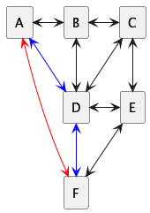

# TD Gestion de voyages

On se propose ici de gérer un réseau de villes par des énumérations, collections et lambda expressions de Java.

Voici le tableau des distances correspondant au réseau à modéliser :

.|A|B|C|D|E|F
-|-|-|-|-|-|-
**A**|0|10|-|20|-|35
**B**|10|0|10|15|-|-
**C**|-|10|0|10|15|20
**D**|20|15|10|0|15|20
**E**|-|-|15|15|0|10
**F**|35|-|20|20|10|0

Dans ce tableau,
- les trajets entre les villes A et F ne sont réalisables qu’en train
- les trajets entres les villes A et D et D et F ne sont réalisables qu’en tram.
- les autres trajets ne sont réalisables qu’en bus.

Le coût au km d’un trajet en train est plus élevé que celui d’un trajet en tram qui est supérieur au coût d’un trajet en bus.<br>
On prendra cout<sub>train</sub> = 1€/km, cout<sub>tram</sub> = 0.3€/km et cout<sub>bus</sub> = 0.1€/km.

La vitesse d’un train est plus élevée que celle d’un tram qui est plus rapide qu’un bus.<br>
On prendra v<sub>train</sub>=70km/h, v<sub>tram</sub>=50km/h et v<sub>bus</sub>=40km/h.


<!-- note, pour plantUml, ci-dessous retirer les espaces entre des tirets -- et le signe > 
```
@startuml trajetsV1
hide empty description
rectangle A
rectangle B
rectangle C
rectangle D
rectangle E
rectangle F
A <-> B
A <-[#blue]-> D
B <-> C
B <-- > D
C <-> D
C <-- > E
D <-> E
D <-[#blue]> F
A <-[#red]> F
E <-- > F
@enduml 
```

-->



---
## Représentation des données
1. **Créer une énumération Moyen** qui liste les moyens de transport Train, Tram et Bus, en initialisant leurs coût et vitesse. Ajoutez les accesseurs (getters pour le cout et la vitesse).
   - Créer une classe ```Test``` qui contiendra un ```main``` et une fonction ```static void testMoyen()``` dans laquelle vous testerez le bon fonctionnement de cette énumération.

2. **Créer une énumération Ville** qui contient les villes A,B,C,D,E,F; en l’étendant pour qu’elle contienne :
   - la matrice des distances (réelles),
   - la fonction ```static double getDist(Ville start, Ville end)``` qui retourne la distance entre les deux villes *start* et *end*.
   - la fonction ```double getDist(Ville end)``` qui retourne la distance entre la ville courante et la ville *end*.
   - Dans la classe ```Test```, créez une fonction ```static void testVille()``` dans laquelle vous testerez le bon fonctionnement de cette énumération.

---
## TrajetSimple
Créer une classe ```TrajetSimple``` qui représente un trajet direct existant entre 2 villes.<br>
TrajetSimple est composé des champs :
  - départ, arrivee : Ville
  - distance,coût,durée : double (la durée exprime des minutes)
  - moyen : Moyen
  - dateDepart, dateArrivee : LocalTime

**- - - -**<br>
**Définir le constructeur** d’un trajet qui prend en entrée le départ, l’arrivée, la date de départ, le moyen ; 
mais sous forme d’énumération et de date :<br>
```TrajetSimple(Ville _depart, Ville _arrivee,  LocalTime _dateDepart, Moyen _moyen)```

Les valeurs des variables coût, durée et date d’arrivée sont calculées automatiquement par la méthode privée private ```void calcule()```.

  - La classe LocalTime permet, entre autres, de définir une heure par deux entiers et d'ajouter des minutes  :
```Java
LocalTime dateDepart = LocalTime.of(10,45);
LocalTime dateArrivee = dateDepart.plusMinutes(30);
```

**- - - -**<br>
**Définir le constructeur** d’un trajet qui prend en entrée le départ, l’arrivée, le moyen sous forme de chaîne et la date de départ sous forme d’entier sous la forme *HHmm*. 
Exemple ```int d=1045``` signifie un depart à 10h45.<br>
```TrajetSimple(String _depart, String _arrivee,  int _dateDepart, String _moyen)```

**- - - -**<br>
**Définir la méthode** ```public void setMoyen(Moyen _moyen)``` qui permet de changer la moyen de locomotion d’un voyage.
Les valeurs des cout, durée, date d'arrivee, doivent être recalculée. 

**Définir la méthode** ```public void setDateDepart(Local _moyen)``` qui permet de changer la date de départ d'un voyage.<br>
Sa date d'arrivée doit être recalculée.

**Dans la classe ```Test```, créez une fonction ```static void testMoyen()```** dans laquelle vous créerez puis afficherez l'ensemble des trajets simples décrits dans l'énoncé.

----
## Catalogue
**Créer une classe Catalogue**.<br>
   - Vous utiliserez une table de hashage ``tableDepart`` de type HashMap qui possède en clé la ville de départ et en valeur l’ensemble des trajets partant de cette ville : 
``` Map<Ville, List<TrajetSimple>> tableDepart;```

   - **Créer la fonction** ```void addTrajetSimple(TrajetSimple trajet)``` qui ajoute le trajet à sa bonne clé dans la table.
   - **Créer la fonction** ```creerCatalogue()``` qui crée la liste des trajets simples du réseau et les ajoute à la table .<br>
     Les trajets ont lieu toutes les 30mn, de 5h00 à 22h00
   - Dans la classe ```Test```, **créer la fonction** ```static void testCatalogue()``` qui appelle la création du catalogue des trajets 
   et qui affiche le trajet le moins cher, et le trajet le plus rapide entre A et F, en utilisant les Collections, les Comparator et la programmation lambda.


   - **Créer la fonction** ```trouveCheminsDirects(Ville depart,Ville arrivee, LocalTime dateDepart, int delaiMax)```
     qui retourne la liste des trajets simples entre départ et arrivée partant entre ```dateDepart``` et ```dateDepart + delaiMax```.
     - il faut utiliser les récentes méthodes sur les listes (_ex. liste.removeIf(.....)_)
     - _Exemple de méthodes utiles_ : si ```date``` et ```dateDepart``` sont de type ```LocalTime``` :
       - ```dateDepart.isAfter(date)``` retourne vrai si ```dateDepart > date```
       - ```dateDepartAuPlusTard.isBefore(date)``` retourne vrai si ```dateDepartAuPlusTard < date```
       - la fonction ```compareTo(LocalTime autre)``` est définie pour les objets de type ```LocalTime```
