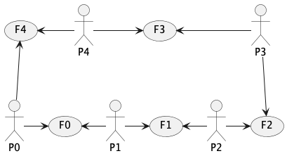

# Dîner des philosophes en Java

Le "Dîner des philosophes" est problème traditionnel de gestion de processus et de partage de ressources, souvent utilisé pour illustrer la gestion de processus.

Voici l'énoncé : 
- 5 philosophes sont attablés et, en boucle tant qu'ils n'ont pas fini leurs assiettes effectuent ces actions   : tenter de prendre des fourchettes, manger, poser les fourchettes, penser, ..
- En effet, ces philosophes mangent des spaghetti avec 2 fourchettes chacun, celles situées à gauche et à droite de l’assiette. 
- Or il n’y a autant de fouchettes que de philosophes.
- Il y a donc un porbklème de partage de ressources (les fourchettes).

La disposition est la suivante :


<!-- note, pour plantUml, ci-dessous retirer les espaces entre deux tirets -- et le signe > 
```
@startuml dinerPhilosophes
hide empty description
P0 -> (F0)
(F0) <- P1
P1 -> (F1)
(F1) <- P2
P2 -> (F2)
P3-> (F2)
(F3) <- P3
P4 -> (F3) 
(F4) <- P4
(F4) <-- P0

@enduml
```

-->



----
## Philosophe
Un **Philosophe** possède un identifiant entier, un lien vers les fourchettes, un nombre de bouchées à ingurgiter, un temps minimum pour avaler une bouchée, un temps variable pour mastiquer, un temps minimum pour réfléchir, un temps variable pour divaguer.

Un philosophe effectue un cycle tant qu’il n’a pas mangé toutes ses bouchées :
1. demande de fourchettes (pense en attendant les fourchettes)
2. dégustation
3. repose de fourchettes
4. penser.

L’objet partagé entre les philosophe est un objet de type **Fourchettes**.
- Cette classe comprend un tableau de n fourchettes
- Cette classe propose les méthode :
  - void prendre(int noPhilo) appelée lorsqu’un philosophe demande des fourchettes
  - void deposer(int noPhilo) appelée lorsqu’un philosophe repose les fourchettes

La classe Philosophe est donc un processus.

----
## Fourchettes

L’accès aux fourchettes doit être synchronisé, c’est à dire qu’un seul processus a le droit d’entrer dans les méthodes *déposer* et *prendre* :
- ```public synchronized void prendre(int no)``` 
- ```public synchronized void deposer(int no)```

Si ’n’ est le nombre total de philosophes et de fourchettes, le philosophe ’no’ mange avec les fourchettes ’no’ et ’(no+1)%n’.

La classe Fourchettes contient les attributs et méthodes suivants :
- ```lesFourchettes``` : un tableau de n booléens (lesFourchettes[i] == true signifie que la fourchette ’i’ est libre)
- ```taille``` : un entier correspondant au nombre de fourchettes (la taille du tableau)
- ```public Fourchettes(int _taille)``` qui crée le tableau de fourchettes et initialise l’ensemble du tableau à true.
- les méthodes ’prendre’ et ’déposer’, en suivant l’exemple des producteurs/consommateurs vu en cours.

----
## Le dîner

La classe ```LeDiner.java```  est la classe principale, à lancer donc. Cette classe 
- crée un objet de type Fourchettes, 
- crée n Philosophes liés à cet objet, rangés dans un tableau
- les ’démarre’
- et calcul les temps minimal, maximal et moyen de repas par les philosophes

