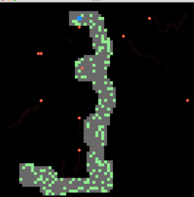

# Poursuite de drones

Il s’agit dans ce TP de programmer une poursuite d’intrus par des drones patrouillant dans un environnement contenant des matières sensibles.

Le TP s’effectuera en plusieurs étapes :

 - 1 joueur seul devant le programme
  - ajout d’une intelligence artificielle "simple" rendant « plus intelligent » le comportement des drones.
  - gestion de jeu (obligatoire) et n joueurs en réseau (facultatif)

>>Le graphisme sera **en JavaFX**.
>>  - *pour installer JavaFx, télécharger la librairie adaptée à votre machine à partir de [openjfx.io](https://openjfx.io/)*
>> 
>> à réaliser seul(e) ou en binôme au maximum
>> 
>> :-1: Pas de copier-coller !
>> 
>> :+1: documentation :
>>  - la documentation explicite du code sous forme de commentaire javadoc
>>   - un bloc d’au minimum 3 lignes doit précéder chaque fonction, incluant les tags @param, @return si possible

-- --

>> **Configuration** IntelliJ pour JavaFX (adapter pour Eclipse, Visual Studio code, ....):<br> 
>> - Dans File -> Project Structure -> Libraries
>>   - choisissez New Project Library (Java) et ajouter le chemin vers le dossier lib de javaFx :
>>    -  /MonDossier/openjfx/lib
>> - **Si cela compile, mais que ça ne s'exécute pas**
>>  - modifier les paramètres de la machine virtuelle au lancement du programme
>>    - Run -> Edit configuration -> add VM argument
>>      - ajouter ceci : --module-path /MonDossier/javafx/lib --add-modules=javafx.controls,javafx.fxml 
>>  - Éventuellement, ajouter la variable d'environnement dans votre IDE : 
>>    - PATH_TO_FX	-> /MonDossier/javafx/lib
>>      - (dans IntelliJ : Preferences -> apparence -> Path Variables)


----
## TP1
L’environnement est une zone (n x m) remplie aléatoirement à d% d'obstacles (arbres qui sont posées aléatoirement dans l’environnement).

Une zone est particulière, car elle contient une donnée recherchée.

Un intrus, piloté par un utilisateur, cherche à atteindre cette zone, puis à ressortir par une des sorties de l’environnement (il existe 4 sorties, situées au milieu de chaque paroi (soit une en (0, m/2), une autre en (n, m/2), une troisième en (n/2, 0) et la dernière en (n/2, m)).

Pour piloter l’intrus, les touches directionnelles seront privilégiées.

L’intrus a un champ de perception limité :
 - au départ, l'environnement est pour lui une zone vide
 - à chaque fois qu’il perçoit des obstacles, il les mémorise (le champ de perception est une zone circulaire de 4 cases de rayon)
 - pour vérifier si une zone contient la donnée recherchée, il doit s’en approcher de 2 cases au minimum

 
Des drones au nombre de ’nbR’ circulent aléatoirement dans la zone :
 - ils ont un champ de vision de type circulaire de rayon 3
 - si un drone perçoit l’intrus, il envoie à tous les autres drones la position perçue de l’intrus
 - si un drone reçoit une position d’intrus, il se dirige vers cette position
 - si un drone s’aperçoit que l’intrus n’est plus là, il en informe les autres et tous reprennent la navigation aléatoire...

Voici un exemple de première réalisation :


--
— -

**Aide**

En suivant l’exemple de la simulation de Fourmis (cf. [TP Fourmis](https://github.com/EmmanuelADAM/coursJavaAvance/tree/master/TP/fourmis))) .

- Créer les classes Drone et Intrus. <br>
  Drone reprend beaucoup de Fourmis, Intrus, un peu moins. 
  Ôter ce qui fait référence aux phéromones et à l’évaporation
  
- Premièrement, ôter le nid, les zones de nourritures, placer des drones (environ 10) au hasard sur la grille et faites les bouger
- Puis ajouter des obstacles (arbres) (cf. le positionnement des cellules actives dans le Jeu de la Vie)
- Puis faites en sorte qu’un drone ne passe pas sur un obstacle (1 condition à changer dans le mouvement repris des Fourmis)
- Puis ajouter un intrus contrôlé par le clavier
- Dans la classe qui étend Application (que l’on peut appeler AppliDrones),
  dans la méthode ``void construireScenePourDrones(Stage primaryStage)``
  en fin de fonction, on peut ajouter le code suivant :
```Java
Intrus intrus = terrain.getIntrus();
Circle dessinIntrus = intrus.getDessin();
dessinIntrus.requestFocus();
dessinIntrus.setOnKeyPressed(e->{
  System.err.println(e.getCode());
  switch(e.getCode()) {
    case UP -> intrus.setDirection(Direction.NORD); intrus.bougerVersDirection(); 
    case LEFT -> intrus.setDirection(Direction.OUEST); intrus.bougerVersDirection(); 
    case DOWN -> intrus.setDirection(Direction.SUD); intrus.bougerVersDirection(); 
    case RIGHT -> intrus.setDirection(Direction.EST); intrus.bougerVersDirection(); 
  }
});
```
--
**A réaliser en priorité avant le TP2 :**

- la possibilité de paramétrer facilement :
  - la vitesse des drones, la vitesse des intrus, la taille de l'environnement, la densité ded obstacles dans l’environnement, le nombre de sorties, le nombre de `zones à trouver’
- utiliser un fichier de logs pouvoir debugguer le programme ou suivre a posteriori son évolution.
  - Dans ce fichier de logs, les messages doivent inclure le ’top horloge’, moment du message)

----
## TP2   

Il doit être possible de paramétrer :
- la dimension de l’environnement,
- le nombre et la position des drones,
- le rythme du tempo,
- la position de l’intrus (initialement auprès d'un des bords de l'environnement),
- la zone de perception de l’intrus,
- la zone de perception de l’intrus par un drone.

----
## TP3   

On peaufine le jeu : 
- pour être capturé, l'intrus doit rester 5 secondes dans le champ de vision d'un drone,
- les arbres ont 2 hauteurs différentes,
- il existe des méga-drones ; ceux-ci peuvent passer au-dessus des petits arbres,
- un drone ne voit pas l'intrus s'il est caché par un arbre,
- les drones tentent de ne pas rester bloqué par un arbre pour rejoindre l'intrus
- des drones dans la même case se percutent et se désactivent
- des méga-drones dans la même case se percutent et se désactivent
- le jeu va crescendo ; peu de drones au debut, et ils sont lents; ils deviennent de plus en plus rapides et de plus en plus nombreux. 

---
